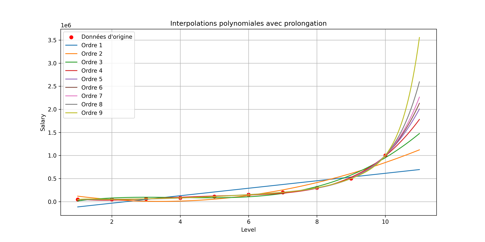
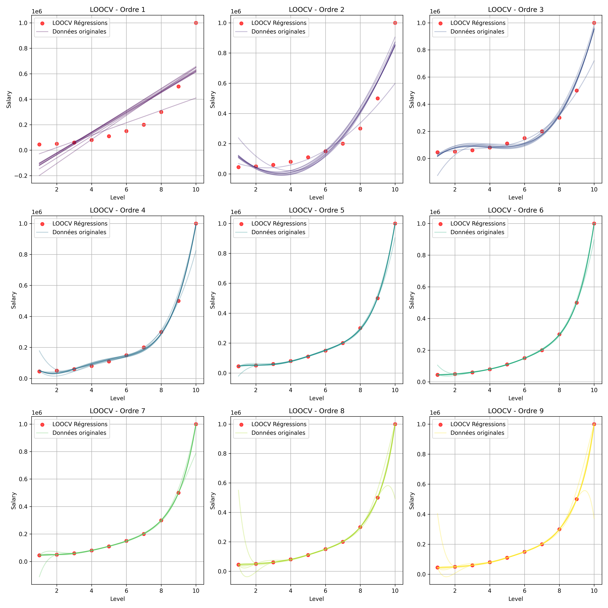
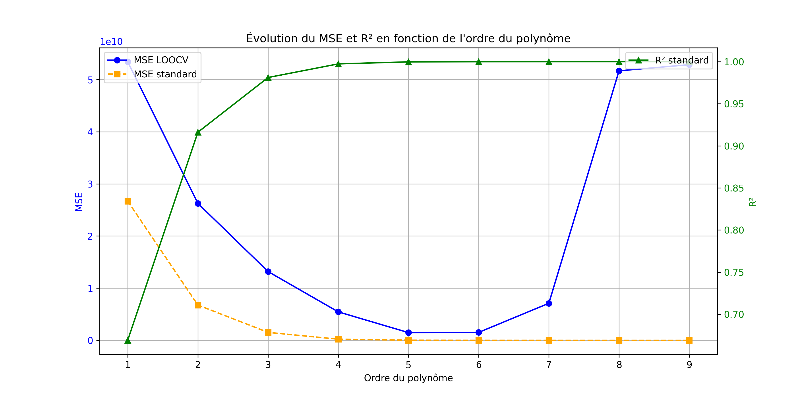

# Polynomial Regression and LOOCV Analysis

## 📌 Project Overview
This project implements **Polynomial Regression** with **Leave-One-Out Cross-Validation (LOOCV)**, enabling users to analyze polynomial fits of different orders and compare standard and LOOCV results. The project also includes visualizations for **interpolations, LOOCV regressions, and performance metrics** (MSE and R²) across different polynomial degrees.

## 🚀 Features
- **Polynomial Regression** with user-specified degree.
- **LOOCV Implementation** to validate the robustness of polynomial models.
- **Visualization of Interpolations**, including curve extrapolation.
- **Graphical comparison** of MSE (Mean Squared Error) and R² with and without LOOCV.
- **Automatic graph saving** in `.png` format for future reference.

## 🔧 Installation Guide

### 1️⃣ Prerequisites
Ensure you have the following installed:
- Python 3.8+
- Virtual Environment (Optional but recommended)

### 2️⃣ Clone the Repository
```sh
$ git clone https://github.com/your-repository/polynomial-regression-loocv.git
$ cd polynomial-regression-loocv
```

### 3️⃣ Install Dependencies
Using `venv`:
```sh
$ python -m venv venv
$ source venv/bin/activate   # On Windows: venv\Scripts\activate
$ pip install -r requirements.txt
```
Or directly install the required libraries:
```sh
$ pip install numpy pandas matplotlib seaborn scikit-learn
```

### 4️⃣ Run the Application
```sh
$ python app.py
```

## 📝 Usage Instructions

### 1️⃣ Select Dataset and Columns
- The program loads data from `data/Position_salaries.csv`.
- You are prompted to select the **X** and **Y** columns for regression.

### 2️⃣ Choose Polynomial Degrees
- You will be asked for a **minimum** and **maximum** polynomial degree.
- The program will compute interpolations for all degrees in this range.

### 3️⃣ View Graphs and Results
- **Standard Polynomial Fits**
- **LOOCV Visualizations (Grouped by Polynomial Degree)**
- **Comparison of Standard and LOOCV MSE + R²**
- **All graphs are saved automatically in `output/`**

## 🛠 Technical Details

### 📂 File Structure
```
📦 polynomial-regression-loocv
 ┣ 📂 data
 ┃ ┗ 📜 Position_salaries.csv
 ┣ 📂 utile
 ┃ ┣ 📜 dataset_manager.py
 ┃ ┣ 📜 polynomial_regression.py
 ┃ ┣ 📜 loocv.py
 ┃ ┗ 📜 visualization.py
 ┣ 📂 output
 ┃ ┣ 📜 interpolations.png
 ┃ ┣ 📜 loocv.png
 ┃ ┗ 📜 mse_comparison.png
 ┣ 📜 app.py
 ┣ 📜 requirements.txt
 ┗ 📜 README.md
```

### 🏗 Module Breakdown

#### `dataset_manager.py`
Handles **CSV file loading and column selection**.

#### `polynomial_regression.py`
- Performs **polynomial regression**
- Normalizes input data
- Computes **MSE & R²**
- Generates **extrapolated interpolations**

#### `loocv.py`
- **Removes one data point at a time** and fits the model
- Stores **all LOOCV regressions** for visualization
- Computes **MSE LOOCV**

#### `visualization.py`
- **Generates and saves** interpolation and LOOCV graphs
- **Displays multiple LOOCV plots in a grid**
- **Compares MSE & R²** on a dual-axis graph

## 📊 Example Output

### 1️⃣ Standard Interpolation Graph


### 2️⃣ LOOCV Interpolations (Grouped by Degree)


### 3️⃣ MSE & R² Comparison


## 👥 Contributing
Feel free to **fork this repository** and submit pull requests if you:
- Improve performance
- Add new regression techniques
- Enhance visualization

To contribute:
```sh
$ git checkout -b feature-branch
$ git commit -m "Your feature description"
$ git push origin feature-branch
$ Create a pull request on GitHub
```

## 📝 License
This project is licensed under the **MIT License** – see the `LICENSE` file for details.

---

📢 **For any issues or feature requests, feel free to open a GitHub issue!** 🚀